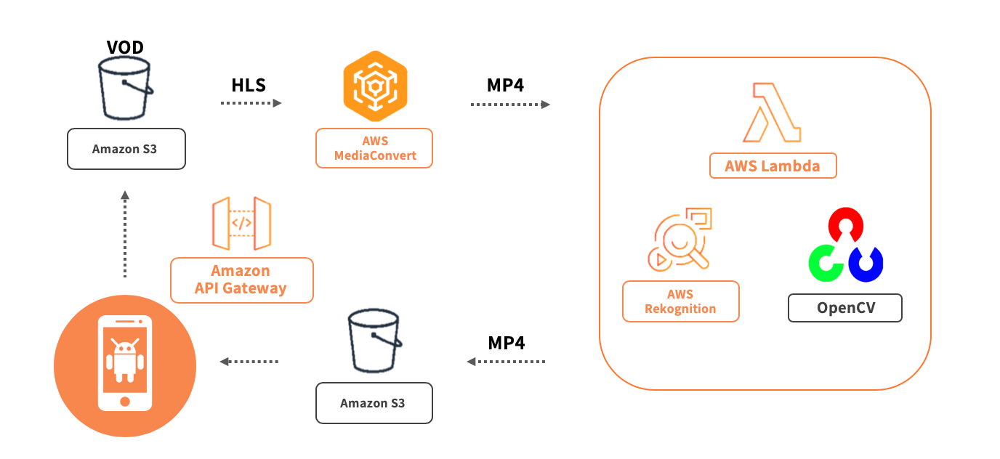

# DNBN_Lambda
AWS Lambda와 OpenCV 라이브러리를 사용하여 모자이크를 영상에 자동으로 입힘

### IDE
- Pycharm 2018.ver
- Android Studio 3
- VS Code

### Library
- OpenCV 4.1.2

License: BSD
- MoviePy 1.0.1

License: MIT 
AWS Lambda - Python3.6, Python3.7

### Service Architecture

### Description

