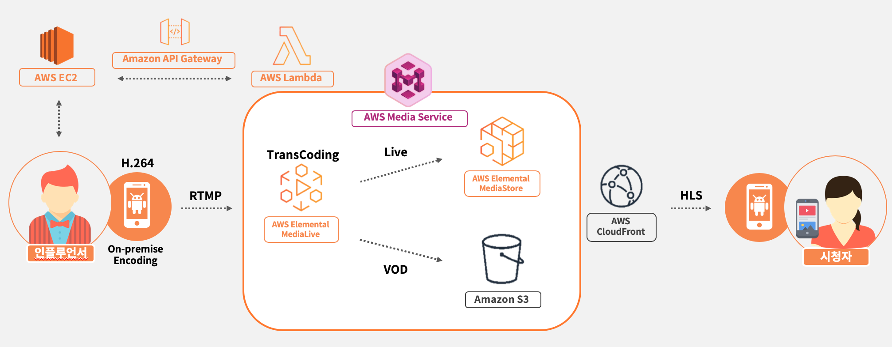

# DNBN_Lambda
AWS MediaService(MediaLive, MediaStore)를 이용해 라이브 스트리밍 및 영상(VOD) 저장 서비스 구축
AWS Lambda + AWS Rekogntion, OpenCV 라이브러리를 사용하여 모자이크를 영상에 자동으로 입힘
AWS API Gateway 서비스로 Http 통신
AWS SNS를 이용하여 서비스 간 메시지 전달

### IDE
- Pycharm 2018.ver
- Android Studio 3
- VS Code

### Library
- OpenCV 4.1.2

License: BSD
- MoviePy 1.0.1

License: MIT 
AWS Lambda - Python3.6, Python3.7

### Service Architecture
##### MediaService

##### Mosaic

### Preview
</img>

### Code Description
[DNBN_media](./Lambda_media/Lambda_lib)
- mliveChannel.py: MediaLive Channel을 관리하는 Class
- mliveInput.py: MediaLive Input을 관리하는 Class
- main.py: 라이브 스트리밍 채널 자동 관리를 위한 실제 실행 코드
~~~python
# Case1-1: IDLE exist - 비어있는 채널 잡는 경우
        if index != -1:
            channel_id = mlive_chaClass.getId(index)
            input_id = mlive_chaClass.getInputId(index)
            url = mlive_inpClass.getUrl(input_id)
            # source_url = 'rtmp://{}:1935/bylive/stream'.format(mlive_chaClass.getSourceIp(index))

            # path update and start
            try:
                mlive_chaClass.updateChannel(user, channel_id, time)
                mlive_chaClass.startChannel(channel_id)
            except Exception as e:
                return {
                    'error': e
                }
            else:
                return {
                    'state': 'exist',
                    'channel_id': channel_id,
                    'source_url': url,
                    'destination_url': mlive_chaClass.getDestinations(index)
                }
~~~
~~~python
# Case1-2: IDLE non-exist - 남아있는 채널이 없어 새로 만들어야 하는 경우
        else:
            # create input
            try:
                input_response = mlive_inpClass.createInput(user, time)
            except Exception as e:
                return {
                    'error': e
                }
            else:
                input_id = input_response['Input']['Id']
                source_url = input_response['Input']['Destinations'][0]['Url']

            # create channel
            try:
                channel_response = mlive_chaClass.createChannel(user, input_id, time)
                channel_id = channel_response['Channel']['Id']
                index = mlive_chaClass.getIndexById(channel_id)

                while mlive_chaClass.getState(index) == 'CREATING':
                    t.sleep(1)
                mlive_chaClass.startChannel(channel_id)
            except Exception as e:
                return {
                    'error': e
                }

            return {
                'state': 'create',
                'channel_id': channel_id,
                'source_url': source_url,
                'destination_url': mlive_chaClass.getDestinations(index)
            }
~~~
~~~python
# Case2: stop channel - 해당 id의 채널 방송을 정지
    elif action == 'stop':
        mlive_chaClass.stopChannel(channel_id)
        return {
            'state': 'stopped',
            'channel_id': channel_id,
        }
~~~

[DNBN_rekognition](./Lambda_rekognition)
- mediaconvert_hls_to_mp4.py: HLS 영상을 MP4로 변환
- lambda_start_faceSearch.py: 사용자 얼굴을 Collection에 추가하고 AWS Rekogntion에 분석을 요청하는 코드

[opencv_mosaic](./Lambda_rekogntion/opencv_mosaic)
- main.py: OpenCV 라이브러리를 통해 영상에 모자이크를 입히는 코드. S3에서 VOD를 Lambda 서버의 /tmp/폴더로 받아, 모자이크를 입힌 뒤 S3에 다시 업로드

~~~python
resultPath = video_processing(jobId, download_path)
# Rekognition 분석 JobId를 받아 실제 영상에 모자이크를 입히는 함수
~~~
~~~python
for key, value in box_dict_pre.items():
    value_next = box_dict_next.get(key)
    # if exist same index
    if value_next:
        frame = mosaic(value, value_next, frame, width, height, ratio)
    # if non-exist same index
    else:
        frame = mosaic(value, None, frame, width, height, ratio)

# write video
writer.write(frame)
# AWS Rekogntion에서 보내준 frame(0.5초 간격) 사이 frame들을 시간 비율에 따라 bbox 이동
~~~
~~~python
face_img = frame[box_dict['top']:box_dict['bottom'], box_dict['left']:box_dict['right']]
face_img = cv2.resize(face_img, (box_dict['width'] // mosaic_rate, box_dict['height'] // mosaic_rate))
face_img = cv2.resize(face_img, (box_dict['width'], box_dict['height']), cv2.INTER_AREA)
frame[box_dict['top']:box_dict['bottom'], box_dict['left']:box_dict['right']] = face_img
return frame
# 지정 범위의 bounding box를 모자이크 입히는 코드
~~~

[moviepy_sound](./Lambda_rekognition/moviepy_sound)
- main.py: Moviepy 라이브러리를 통해 영상에 소리를 입히는 코드
~~~python
originalVideo = VideoFileClip('/tmp/test.mp4')
audio = originalVideo.audio
audio.write_audiofile('/tmp/my.mp3')

resultVideo = VideoFileClip('/tmp/test2.mp4')
resultVideo.write_videofile('/tmp/result.mp4', audio='/tmp/my.mp3')
# 원본 파일에서 음성 추출 후 모자이크 처리된 파일에 음성 합치기
~~~

### ISSUE
#### AWS Lambda
- 실행 파일(.py)과 파일 내에 핸들러(lambda_handler) 확인 필수(불일치 시 에러)
- 다른 서비스를 쓰기 위해선 Role 권한 지정 필요
- AWS의 별도 서버에서 돌아가기 때문에, '/tmp/' 폴더 제외 접근 권한 금지
- 운영체제: AWS linux 1(운영체제 별 라이브러리 빌드 필요 시 참고 - OpenCV, Moviepy)
#### Pass Role
- AWS 내의 다른 서비스 이용 중 역할 전달(Pass Role)이 필요할 시, 해당 서비스에 대한 신뢰관계 설정 필수 [참고](https://docs.aws.amazon.com/ko_kr/IAM/latest/UserGuide/id_roles_use_passrole.html)
#### AWS API Gateway
- Http 통신을 위해선 AWS Certificate 포함 필요
- 자체 SDK 배포를 통한 사용 추천
#### AWS Rekognition
- 저장된 동영상의 경우 500ms 당 1 frame. Only (MOV, MP4) 지원
- 라이브 스트리밍의 경우(Kinesis Video Streams) 1000ms 당 1 frame
#### AWS MediaService
- MediaStore와 MediaPackage 둘 다 라이브 스트리밍 서비스. 차이점은 배포 형식(확장자) 차이(MediaStore가 속도면 우위)
- MediaLive Channel 개수 최대 5개(문의를 통해 증설 가능)

#### Etc
- 가끔 AWS 서비스 응답 코드에 json dump 에러가 뜨는데, 이는 time method 인식이 안되기 때문. 아래 코드를 이용하여 해결
~~~python
json_data = json.dumps(response, default=json_default)
~~~
~~~python
def json_default(value): 
    if isinstance(value, datetime.date): 
        return value.strftime('%Y-%m-%d-%H-%M') 
    raise TypeError('not JSON serializable')
~~~
- OpenCV는 영상처리 라이브러리이기 때문에 결과물에 소리가 존재하지 않음. 별도의 처리 과정 필요(Moviepy)
- Moviepy를 Lambda에서 사용 중, FFMPEG의 환경변수 IMAGEIO_FFMPEG_EXE 접근 권한이 denied 되는 경우
~~~python
os.environ['IMAGEIO_FFMPEG_EXE'] = '/tmp'
s3.download_file('bylivetest', 'ffmpeg-linux64-v4.1', '/tmp/ffmpeg-linux64-v4.1')
# 환경변수가 참조하는 해당 실행 파일을 S3에 미리 업로드한 뒤, 함수 내에서 호출
~~~

 

